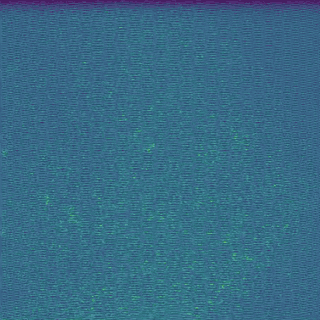
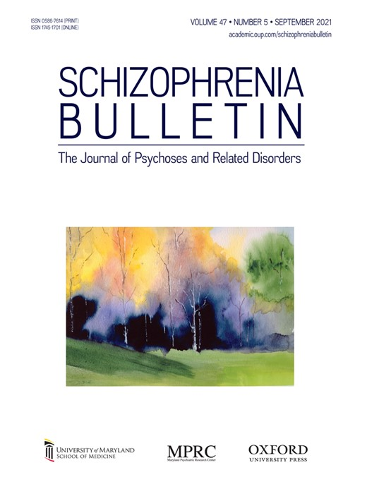
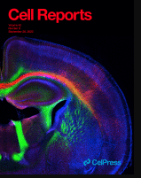
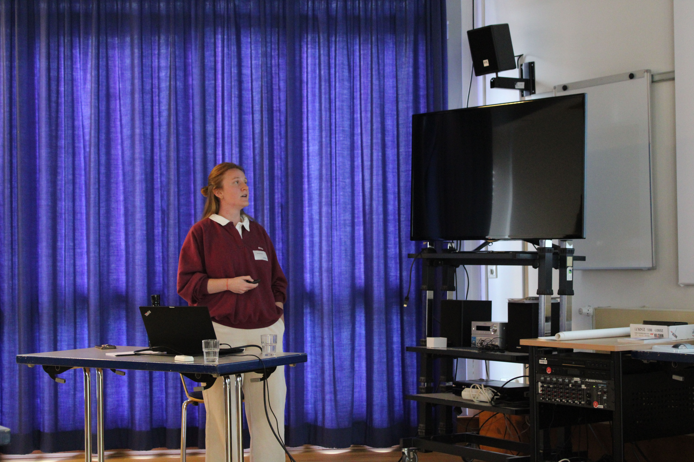
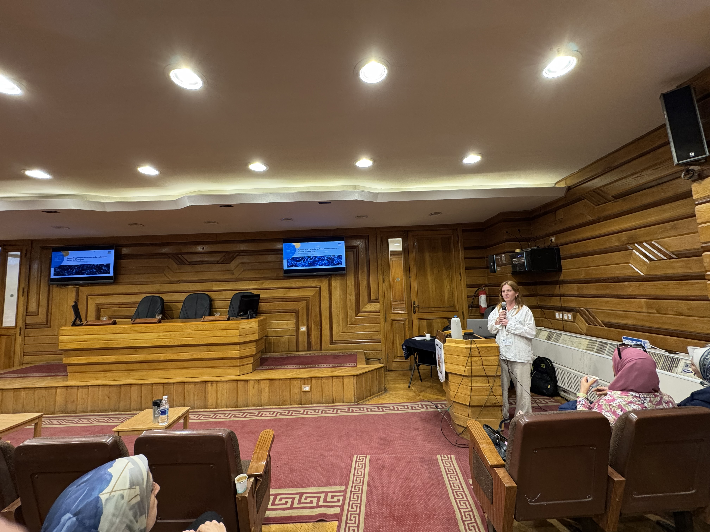
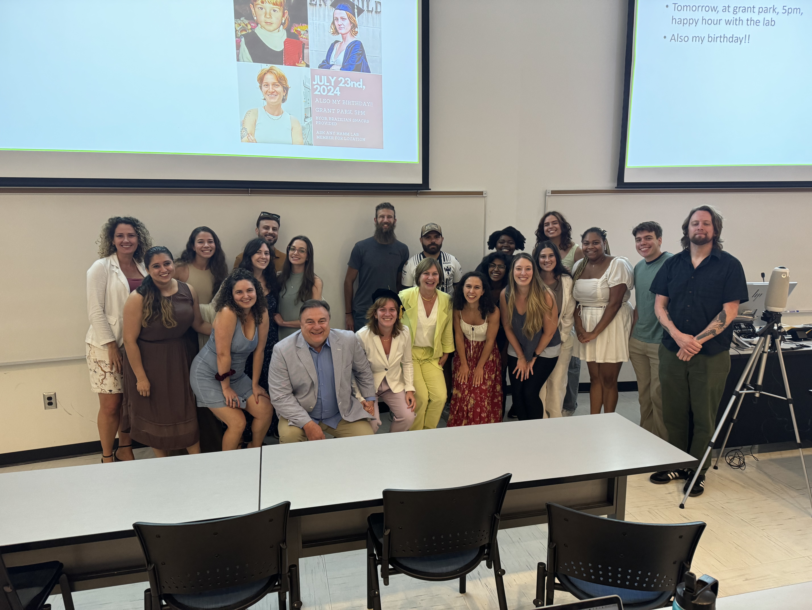

<h2 style="border-top: 0px solid #dddddd; padding-top: 18px; margin-top: 30px;">About Me</h2>

  

    
  

  

    

      Neuroscientist. Curious generalist. I want to understand the fundamental principles of the brain. I have done it through predictive coding, psychedelics and epilepsy research. Huge human nature enthusiast. Skilled with AI tools. If I don’t know it, I figure it out. Born and raised in Brazil. Trained in the United States. Currently in Bonn, Germany.
    

    
<b>Techniques:</b> cortical+hippocampal cranios, calcium imaging, optogenetics, electrophysiology

    
<b>Contact:</b> gbastos-at-uni-bonn.de

  

  <svg viewBox="0 0 24 24" width="18" height="18" aria-label="Spotify" style="vertical-align: middle; margin-right: 8px; fill: #1DB954; display: inline-block;">
    <circle cx="12" cy="12" r="12" fill="#1DB954"></circle>
    <circle cx="12" cy="12" r="7.2" fill="#ffffff" opacity="0.18"></circle>
    <path d="M17.6 15.6c-.2.3-.6.4-.9.2-2.4-1.5-5.4-1.8-9-.9-.3.1-.7-.1-.8-.4-.1-.3.1-.7.4-.8 4-.9 7.4-.6 10.1 1 .3.2.4.6.2.9zm1.1-2.8c-.3.4-.8.5-1.2.2-2.8-1.7-7.1-2.2-10.4-1.2-.4.1-.8-.1-.9-.5-.1-.4.1-.8.5-.9 3.8-1.2 8.8-.6 12.1 1.5.4.2.5.8.2 1.2zm.1-2.9c-3.3-2-8.7-2.2-11.8-1.2-.5.1-.9-.2-1-.7-.1-.5.2-.9.7-1 3.7-1.2 9.5-.9 13.1 1.4.4.3.6.8.3 1.2-.3.3-.8.5-1.3.3z" fill="#ffffff"></path>
  </svg>
  Check out my appearance on
  <a href="https://open.spotify.com/episode/6TPZACMdm2qDWuIeMqjT8i?si=2Yz8i4cqRpSv5LbRNjgH7w&utm_source=copy-link" target="_blank" rel="noopener" style="color: #111; text-decoration: underline;">
    a podcast where I share my ideas about consciousness, spirituality, and the brain →
  </a>

<h2 style="border-top: 1px solid #dddddd; padding-top: 18px; margin-top: 30px;">Current Project</h2>

  

    

      I currently study hippocampal circuits in epilepsy. Although epilepsy is
      different from my previous research, it touches on another fundamental
      property of the brain: how neural circuits generate synchronized activity,
      and what happens when that activity gets out of control.
    

    

      In particular, I study <em>spreading depolarization</em>. This phenomenon
      can occur when the brain experiences a seizure, stroke, trauma, or
      inflammation. It consists of a slowly spreading wave of intense neuronal
      depolarization followed by widespread silencing of neural activity.
    

    

      My central question is whether spreading depolarization acts as a
      protective reset mechanism or whether it further damages already
      vulnerable tissue and contributes to pathology.
    

  

  

    
  

<h2 style="border-top: 1px solid #dddddd; padding-top: 18px; margin-top: 30px;">Past Projects</h2>

<!-- PROJECT 1 -->

  

  

    <h3 style="margin-top: 0; margin-bottom: 8px; font-size: 1.1rem; line-height: 1.4;">
      Somatostatin interneurons in information-processing deficits
    </h3>

    

      A review connecting SST-interneuron dysfunction, disrupted neural
      oscillations, and impaired contextual information processing in
      schizophrenia.
    

    

      <a href="https://pmc.ncbi.nlm.nih.gov/articles/PMC8379548/" style="color: #666666; text-decoration: none;">
        Read
      </a>
      &nbsp;&nbsp;·&nbsp;&nbsp;
      <a href="SST.pdf" download style="color: #666666; text-decoration: none;">
        PDF
      </a>
    

  

<!-- PROJECT 2 -->

  

  

    <h3 style="margin-top: 0; margin-bottom: 8px; font-size: 1.1rem; line-height: 1.4;">
      Top-down input modulates visual context processing through an
      interneuron-specific circuit
    </h3>

    

      This study shows how higher visual areas coordinate with local SST and
      VIP interneurons to shape contextual processing in the primary visual
      cortex.
    

    

      <a href="https://pubmed.ncbi.nlm.nih.gov/37708021/" style="color: #666666; text-decoration: none;">
        Read
      </a>
      &nbsp;&nbsp;·&nbsp;&nbsp;
      <a href="topdown.pdf" download style="color: #666666; text-decoration: none;">
        PDF
      </a>
    

  

<!-- PROJECT 3 -->

  

  

    <h3 style="margin-top: 0; margin-bottom: 8px; font-size: 1.1rem; line-height: 1.4;">
      Psychedelics relax predictive processing in the post-acute period
    </h3>

    

      Evidence from humans and mice suggests that familiar stimuli remain more
      surprising after psychedelic exposure, consistent with a temporary
      relaxation of top-down predictions.
    

    

      <a href="https://pubmed.ncbi.nlm.nih.gov/42367980/" style="color: #666666; text-decoration: none;">
        Read
      </a>
      &nbsp;&nbsp;·&nbsp;&nbsp;
      <a href="psychedelics.pdf" download style="color: #666666; text-decoration: none;">
        PDF
      </a>
    

  

<!-- PROJECT 4 -->

  

  

    <h3 style="margin-top: 0; margin-bottom: 8px; font-size: 1.1rem; line-height: 1.4;">
      Mismatch negativity develops in adolescence and independently of
      microglia
    </h3>

    

      Context-sensitive neural responses emerge during adolescence, while
      microglial depletion does not prevent their development.
    

    

      <a href="https://pubmed.ncbi.nlm.nih.gov/41279836/" style="color: #666666; text-decoration: none;">
        Read
      </a>
      &nbsp;&nbsp;·&nbsp;&nbsp;
      <a href="microglia.pdf" download style="color: #666666; text-decoration: none;">
        PDF
      </a>
    

  

<!-- PROJECT 5 -->

  

  

    <h3 style="margin-top: 0; margin-bottom: 8px; font-size: 1.1rem; line-height: 1.4;">
      Global context rapidly shapes sensory responses in V1
    </h3>

    

      This work shows that primary visual cortex responds not only to local
      stimulus patterns, but also to broader patterns that provide global
      context.
    

    

      <a href="https://pubmed.ncbi.nlm.nih.gov/41542391/" style="color: #666666; text-decoration: none;">
        Read
      </a>
      &nbsp;&nbsp;·&nbsp;&nbsp;
      <a href="global.pdf" download style="color: #666666; text-decoration: none;">
        PDF
      </a>
    

  

<h2 style="border-top: 1px solid #dddddd; padding-top: 18px; margin-top: 30px;">Background</h2>

  <!-- EDUCATION -->
  

    <h3 style="margin-top: 0;">Education</h3>

    

      
      

        <strong>MS and PhD in Neuroscience</strong> 
        Georgia State University 
        2019–2024
      

    

    

      
      

        <strong>BS in Biotechnology</strong> 
        Pennsylvania State University 
        2015–2019
      

    

  

  <!-- LABS -->
  

    <h3 style="margin-top: 0;">Labs</h3>

    

      <strong>
        <a href="https://wenzel-lab.com/">
          Wenzel Lab ↗
        </a>
      </strong> 

      Postdoctoral researcher · University of Bonn 

      
        Hippocampal circuits, calcium imaging, electrophysiology,
        optogenetics, and behavior
      
    

    

      <strong>
        <a href="https://jordanphamm.blog/">
          Hamm Lab ↗
        </a>
      </strong> 

      PhD researcher · Georgia State University 

      
        Cortical circuits, calcium imaging, electrophysiology, and
        optogenetics
      
    

    

      <strong>
        <a href="https://lrc.gsu.edu/">
          Language Research Center ↗
        </a>
      </strong> 

      PhD Rotation with Dr. Sarah Brosnan 

      
        Non-human primate handling 
      
    

  

<h2 style="border-top: 1px solid #dddddd; padding-top: 18px; margin-top: 30px;">Recent Presentations</h2>

  

    
    

      <h3 style="margin: 0 0 6px; font-size: 1rem; line-height: 1.4;">Top-down modulation of visual context processing</h3>
      
Bernstein Conference · Frankfurt, Germany · September 2025

    

  

  

    
    

      <h3 style="margin: 0 0 6px; font-size: 1rem; line-height: 1.4;">Building and breaking context in the visual cortex</h3>
      
International Max Planck Research School Retreat · Remscheid, Germany · October 2025

    

  

  

    
    

      <h3 style="margin: 0 0 6px; font-size: 1rem; line-height: 1.4;">Spreading depolarization as a key disease factor in epilepsy</h3>
      
DAAD Summer School · Cairo, Egypt · June 2026

    

  

  

    
    

      <h3 style="margin: 0 0 6px; font-size: 1rem; line-height: 1.4;">Circuit, cell and molecular mechanisms for context processing</h3>
      
Dissertation Defense · Georgia State University · July 2024

    

  

  <svg viewBox="0 0 24 24" width="18" height="18" aria-label="YouTube" style="vertical-align: middle; margin-right: 8px; display: inline-block;">
    <path d="M23.5 6.2c-.3-1.1-1.2-2-2.3-2.3C19.3 3.4 12 3.4 12 3.4s-7.3 0-9.2.5C1.7 4.2.8 5.1.5 6.2.4 7.9.4 12 .4 12s0 4.1.1 5.8c.3 1.1 1.2 2 2.3 2.3 1.9.5 9.2.5 9.2.5s7.3 0 9.2-.5c1.1-.3 2-1.2 2.3-2.3.1-1.7.1-5.8.1-5.8s0-4.1-.1-5.8zM9.9 15.5V8.5l6.1 3.5-6.1 3.5z" fill="#FF0000"></path>
  </svg>
  Also, check out this
  <a href="https://www.youtube.com/watch?v=1emHWHBzvaw" target="_blank" rel="noopener" style="color: #111; text-decoration: underline;">
    2022 science outreach video, where I explain my research →
  </a>

  

    <h2 style="border-top: 1px solid #dddddd; padding-top: 18px; margin-top: 0;">Conferences</h2>
    <ul style="margin-top: 12px; padding-left: 18px; line-height: 1.7;">
      <li>Cold Spring Harbor Laboratory Conference on Neuronal Circuits, 2022</li>
      <li>Society of Biological Psychiatry's Annual Meeting, 2022</li>
      <li>Society of Neuroscience Annual Meeting, 2022</li>
      <li>Gordon Research Seminar & Conference - Neuronal circuit for Modulation of Behavior, 2023</li>
      <li>Bernstein Conference, 2025</li>
      <li>Deutschen Gesellschaft für Neurologie, 2025</li>
      <li>International Conference on Spreading Depolarization, Windsor, 2025</li>
      <li>Deutscher Akademischer Austauschdienst (DAAD) Summer School, Cairo, 2026</li>
      <li>Gordon Reasearch Conference - Mechanism for Epilepsy and Neuronal Synchronization, Barcelona, 2026</li>
    </ul>
  

  

    <h2 style="border-top: 1px solid #dddddd; padding-top: 18px; margin-top: 0;">Awards</h2>
    <ul style="margin-top: 12px; padding-left: 18px; line-height: 1.7;">
      <li>Andrew Clancy Neuroscience Graduate Scholarship - Georgia State University, Neuroscience Institute</li>
      <li>Brains & Behavior Fellowship - Georgia State University Brains and Behavior Program (B&B)</li>
      <li>Dean's Graduate Professional Development Award - Georgia State University College of Arts & Sciences</li>
      <li>2CI Fellowship in Neuroinflammation - Georgia State university Center for Neuroinflammation and Cardiovascular Diseases (CNCD)</li>
    </ul>
  

<h2 style="border-top: 1px solid #dddddd; padding-top: 18px; margin-top: 30px;">Languages</h2>
English   Portuguese   German (B1) 

<h2 style="border-top: 1px solid #dddddd; padding-top: 18px; margin-top: 30px;">Writings</h2>

  <h3 style="margin-top: 0;">
    This is you
  </h3>

  

   Poem written as a preface for my thesis.
  

  

    <a href="Writings/thisisyou.html">
      Read essay →
    </a>
  

